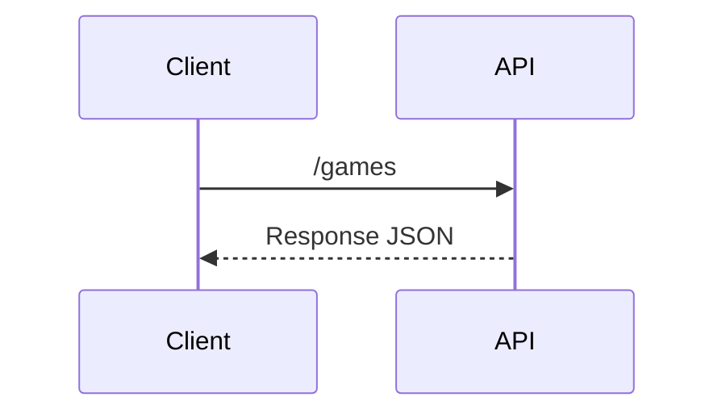

# Java Consumer API Games

Construction of an API in **Java to consume the Games API** built in another Repository.

## Response

```
{
	"totalGames": 27323,
	"totalPages": 2732,
	"currentPage": 2732,
	"games": [
		{
			"id": "60021833-b6e7-44ee-a194-fd8accfab78f",
			"gameName": "Zwei!!",
			"systemFull": "PlayStation 2",
			"publisher": "Taito",
			"developer": "Nihon Falcom Corporation",
			"releaseDate": "26/08/2004",
			"imageUrl": "https://www.vgchartz.com/games/boxart/full_2454347JapanFrontccc.jpg"
		},
		{
			"id": "eef7a167-2dcf-4cb3-9ede-2e0661406c0c",
			"gameName": "じんるいのみなさまへ",
			"systemFull": "Nintendo Switch",
			"publisher": "Unknown",
			"developer": "Nippon Ichi Software",
			"releaseDate": "09/08/2003",
			"imageUrl": "https://www.vgchartz.com/games/boxart/full_470714JapanFrontccc.jpg"
		},
		{
			"id": "6076ae3f-c6d2-4f34-9ef9-8860c9ad4036",
			"gameName": "レミロア~少女と異世界と魔導書",
			"systemFull": "Nintendo Switch",
			"publisher": "Unknown",
			"developer": "Pikii",
			"releaseDate": "09/08/2003",
			"imageUrl": "https://www.vgchartz.com/games/boxart/full_5715569JapanFrontccc.jpg"
		}
	]
}

```

## UML diagrams

You can render UML diagrams using [Mermaid](https://mermaidjs.github.io/). For example, this will produce a sequence diagram:


